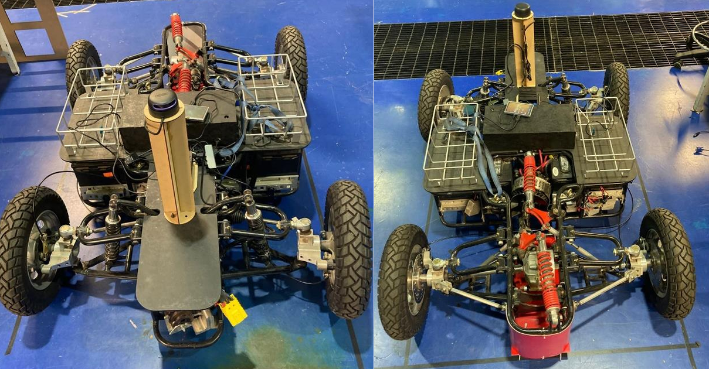
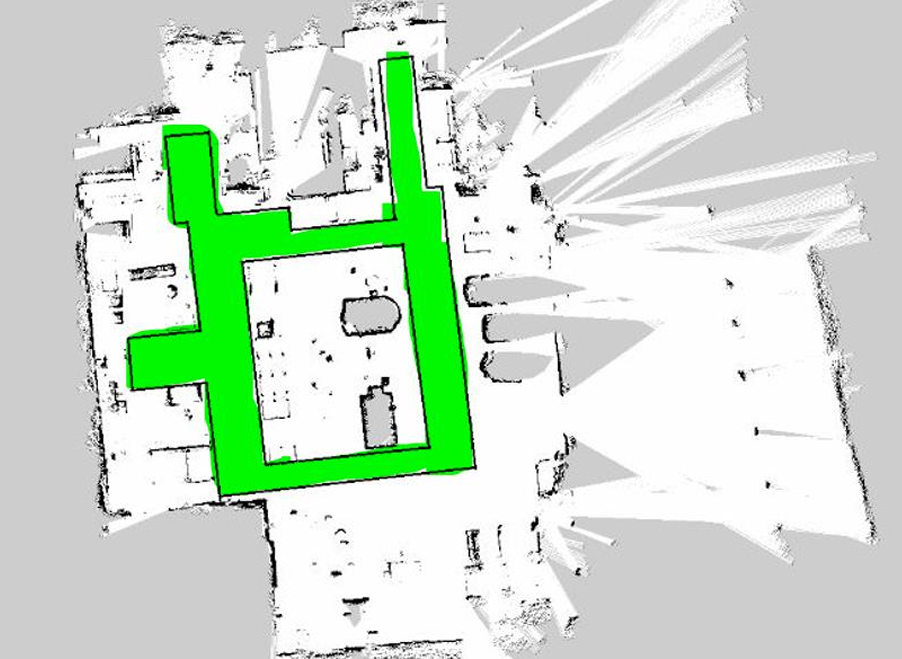

## Overview

We developed an Autonomous Mobile Vehicle  using a combination of Jetson Xavier for high-level processing, RPLIDAR A3 for mapping and localization, and an Arduino Mega for low-level actuation. Our team designed and implemented the electrical system, control interfaces, CAD mounts, and ROS integration. The AGV successfully navigated autonomously within the mapped area of CIMA using ROS, Hector SLAM, and TEB Local Planner. 

## Project Highlights: 

- Designed and fabricated a reinforced electrical wiring system
- Integrated voltage converters (48V to 12V, 12V to 5V, 12V to 19V) for safe and efficient power management.
- Replaced the steering motor with a 24V scooter motor and sprocket system, integrating a potentiometer for angular feedback.
- Mounted the RPLIDAR on a custom laser-cut platform aligned with the vehicle’s center.
- Installed Jetson Xavier with secure custom mount and configured ROS-based autonomous navigation.
- Generated a live map of the CIMA building and planned paths using Hector SLAM and TEB Planner.
- Programmed mode switching between autonomous and manual via RC control
- Developed and deployed Python ROS nodes to communicate velocity commands using ROS Serial

## Technologies and Tools Used
- Hardware: Jetson Xavier, Arduino Mega, RPLIDAR A3, DC motors, step-down converters, relays.
- Software: ROS, RViz, Hector SLAM, TEB Planner, Python, GIMP, SolidWorks 

## Gallery

  
  
  

