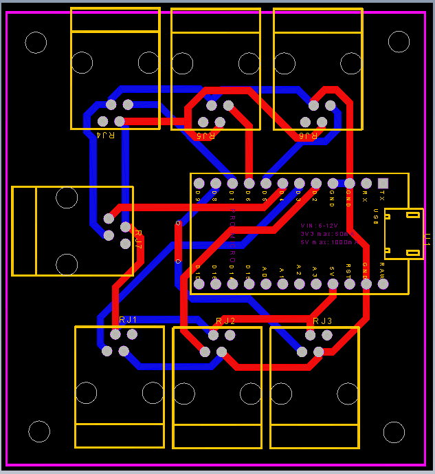
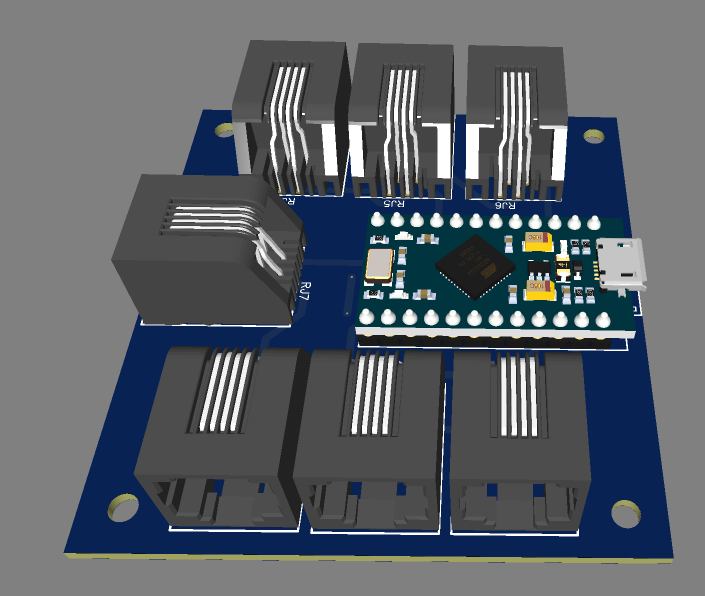
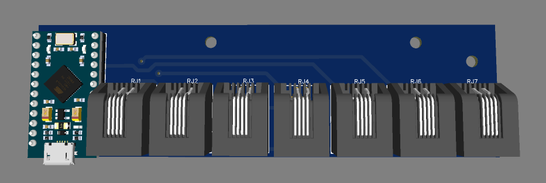
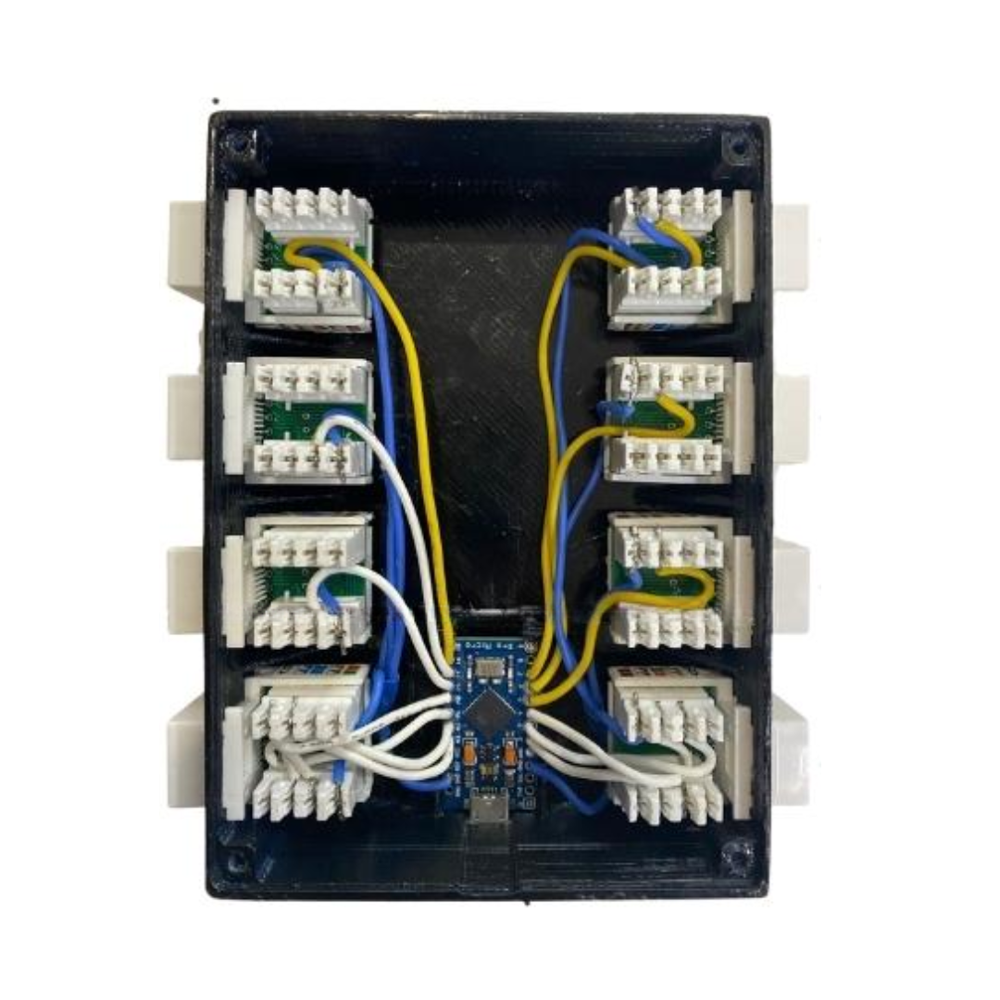

## Overview

This module connects sensors from a driving simulator using RJ45 Keystone jacks and custom wiring. It includes signals such as blinkers, gear selector, handbrake, seatbelt, and ignition. Each sensor is mapped to a virtual joystick button through a USB HID interface.

The firmware handles input logic and emulates a USB joystick using the Joystick.h library. The module is housed in a 3D-printed case and has a custom PCB prepared for future versions.

## Key Features

- Plug-and-play sensors via RJ45 connectors  
- Arduino Pro Micro with custom firmware  
- Logical handling of multiple inputs  
- 3D printed enclosure, PCB-ready for future upgrade  
- Real-time USB joystick mapping.

## Technologies Used

- 3D CAD (SolidWorks)  
- PCB design (KiCad)  
- Arduino C++  
- Joystick.h HID library  
- 3D printing  

## Gallery

  
  
  
  
  
  
  
  
  

