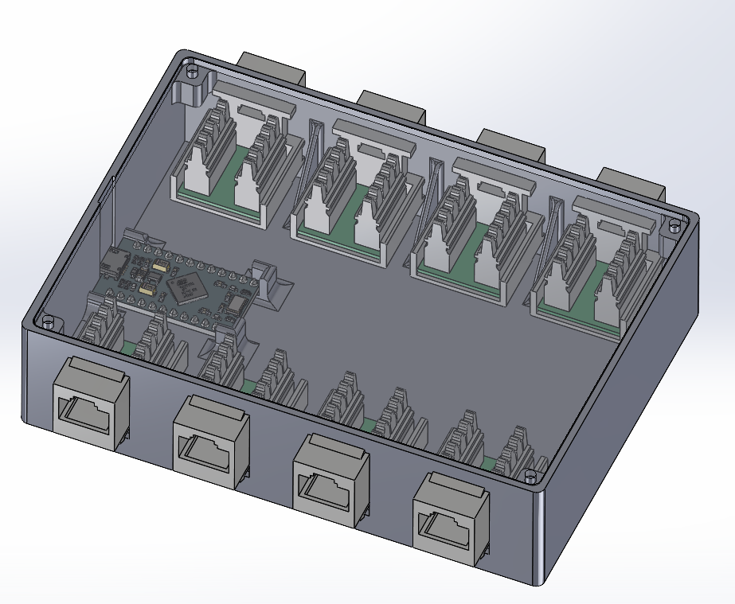
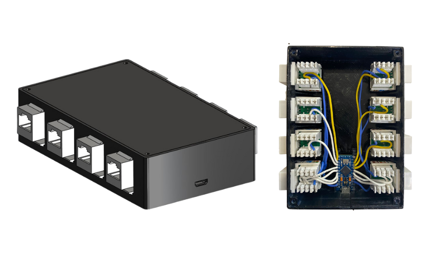
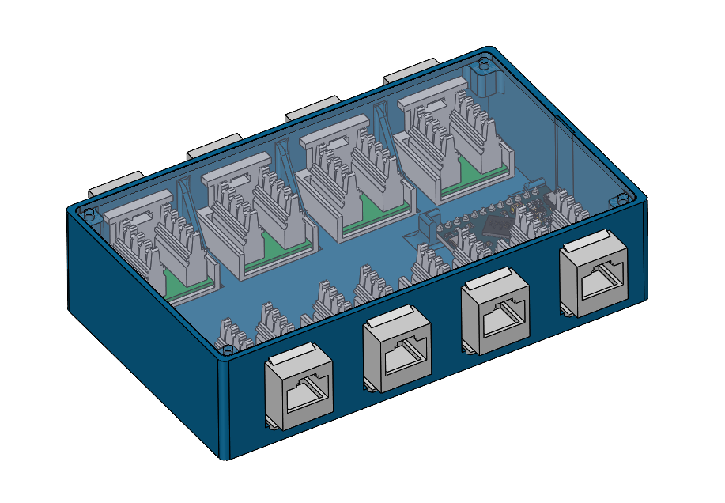
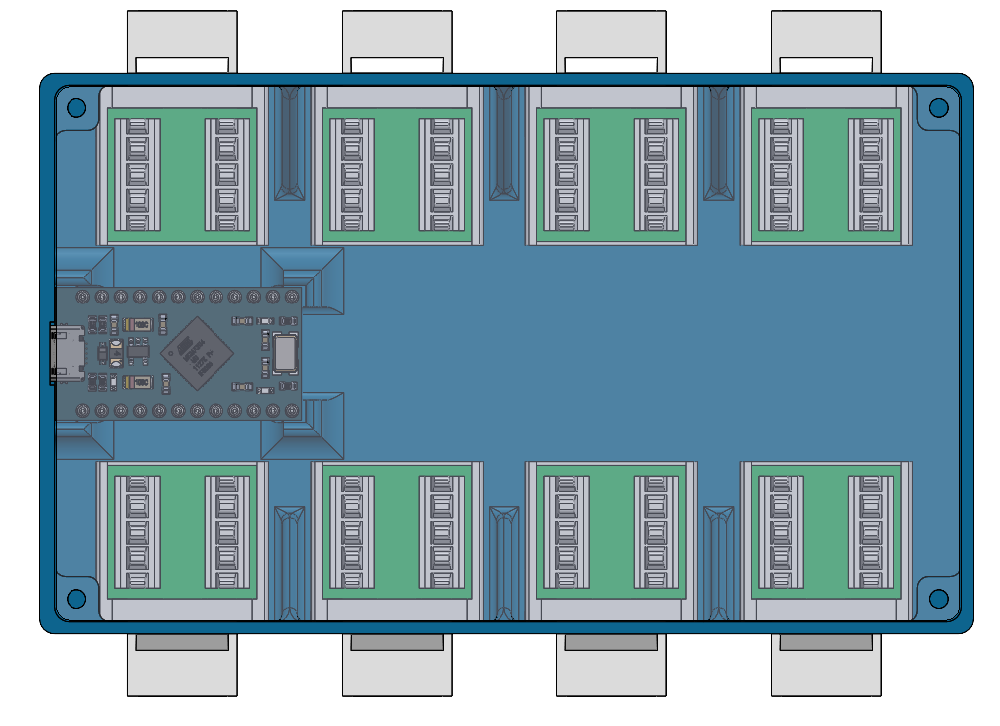

## Overview

Cloud Surfer 2022 was a radio-controlled cargo aircraft developed as part of the SAE Aerodesign Mexico competition. The project focused on aerodynamic optimization, structural feasibility, and payload integration within competition constraints.

## Tools and Technologies

- SolidWorks for 3D modeling  
- Ansys Fluent for CFD simulation  
- XFLR5 for preliminary aerodynamic analysis  
- MATLAB for performance estimation  

## Gallery

    <!-- 
    
    
    
    
    
    
    
     -->

