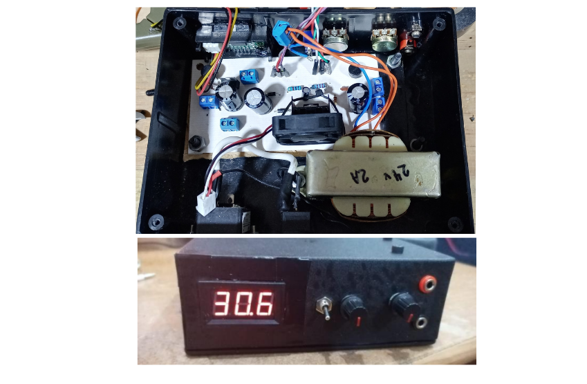
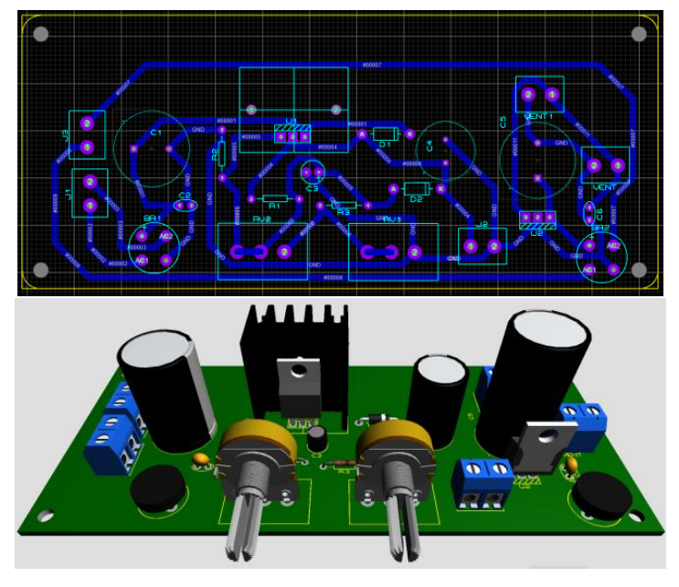
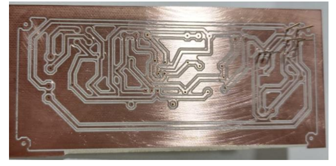

## Overview

This project consists of the design and implementation of a variable DC power supply. The system provides an output voltage ranging from 0 V to 20 V. The circuit was simulated in Proteus, fabricated on a custom PCB.

- Variable voltage output: 0 V to 20 V  
- LM317 regulator
- Full-wave bridge rectifier and smoothing capacitors  
- Manual adjustment via potentiometer  
- Integrated voltmeter display  
- Validated output stability under varying load conditions

## Tools and Components

- Simulation: Proteus 
- Fabrication: PCBWay  

## Gallery

  
  
  

