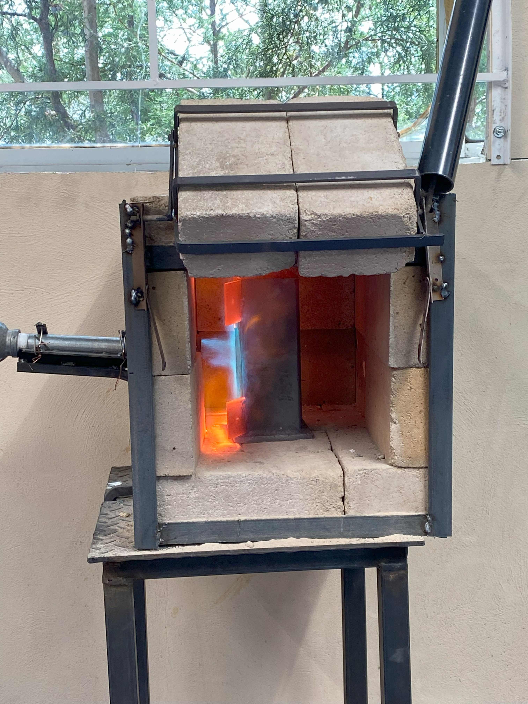
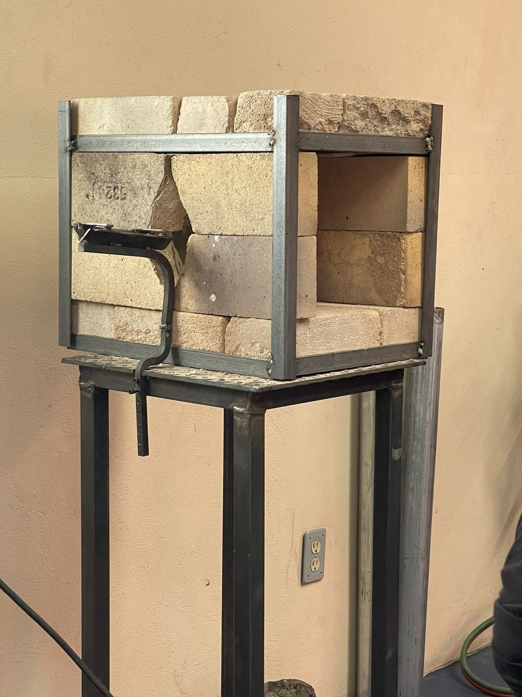

## Overview

This project consisted of building a gas-powered forge. The structure was made using hard fire bricks inside a steel shell. Heat is provided by a propane torch connected to a steel pipe acting as an atmospheric burner inlet. The burner operates without forced air, relying on natural air intake to sustain combustion.

The front of the forge includes a fire brick door that can be manually lifted to insert or remove metal parts.

## Reference

Inspired by the following video:


## Gallery

  
  

