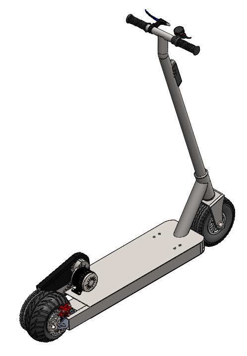
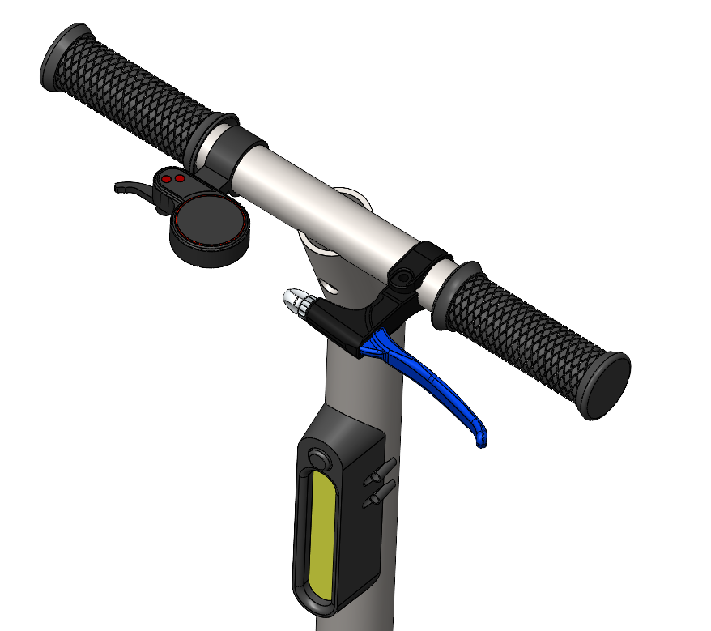
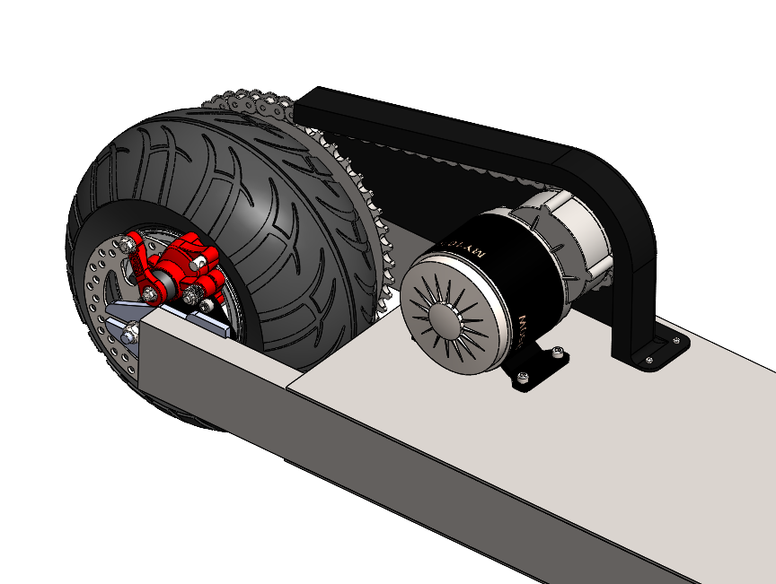
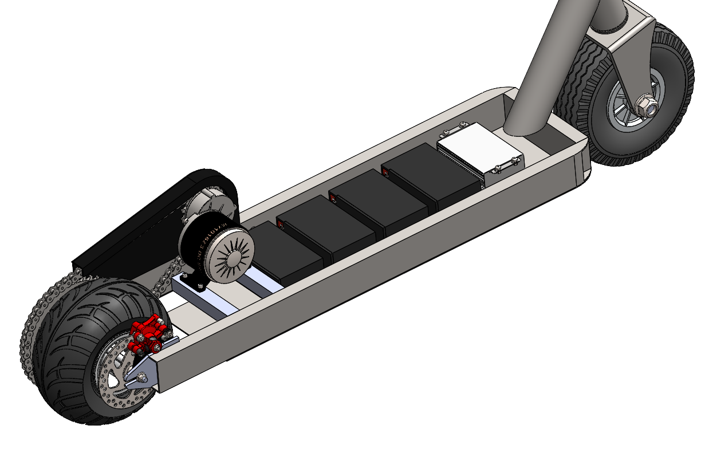

## Overview

This project focused on the design and development of an electric scooter as part of a mechatronic design course. The process followed a complete engineering methodology including user needs analysis, system architecture, mechanical and electronic design, simulation, and manufacturability evaluation.

The project integrated CAD modeling, structural analysis, circuit design, and simulations to create a functional and realistic design tailored for urban and off-road use.

## Design Methodology

- **User-Centered Design**: Needs analysis using surveys and translation of requirements via QFD and House of Quality  
- **System Modeling**: Functional decomposition, black-box representation, and system flow diagrams  
- **Concept Evaluation**: Morphological matrix for idea generation and Pugh chart for selection  
- **Mechanical Structure**: Modular frame based on aluminum extrusions, foldable design with reinforced hinges  
- **Electrical System**: Simulated in Proteus, including throttle control, MOSFET-based driver, and LCD feedback display  
- **Simulation and Validation**:  
  - Static structural FEA (Von Mises, displacement)  
  - Modal analysis to identify natural frequencies (69.5 Hz to 325.5 Hz)  
- **Manufacturing Plan**: Designed for low-cost fabrication using conventional tools, avoiding CNC dependence  

## Key Features

- Max speed over 25 km/h  
- Modular structure using aluminum profiles  
- Foldable mechanism for easy storage  
- Display for battery level and speed feedback  
- Off-road capable wheels  
- Manual and electronic braking systems  
- Cost-effective design (estimated under $12,000 MXN)  

## Technologies Used

- SolidWorks for 3D modeling and assembly  
- FEA simulation 
- Proteus for circuit simulation  
- Arduino for speed control and display interface  
- Lead-acid or Li-ion battery packs (18650 cells)  
- DC brushed or BLDC in-wheel motors (24V–48V, 250–500 W)  

## Gallery

  
  
  
      

