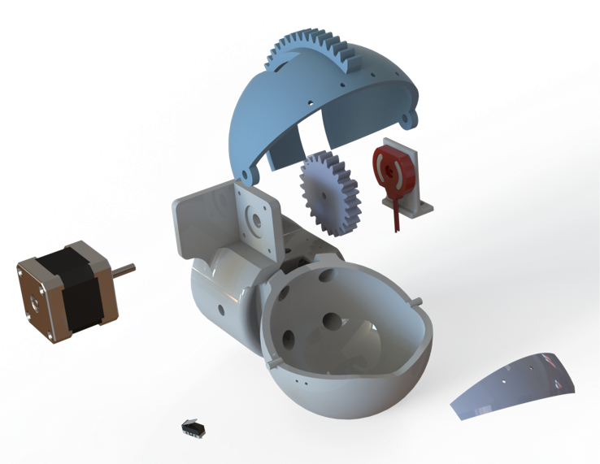
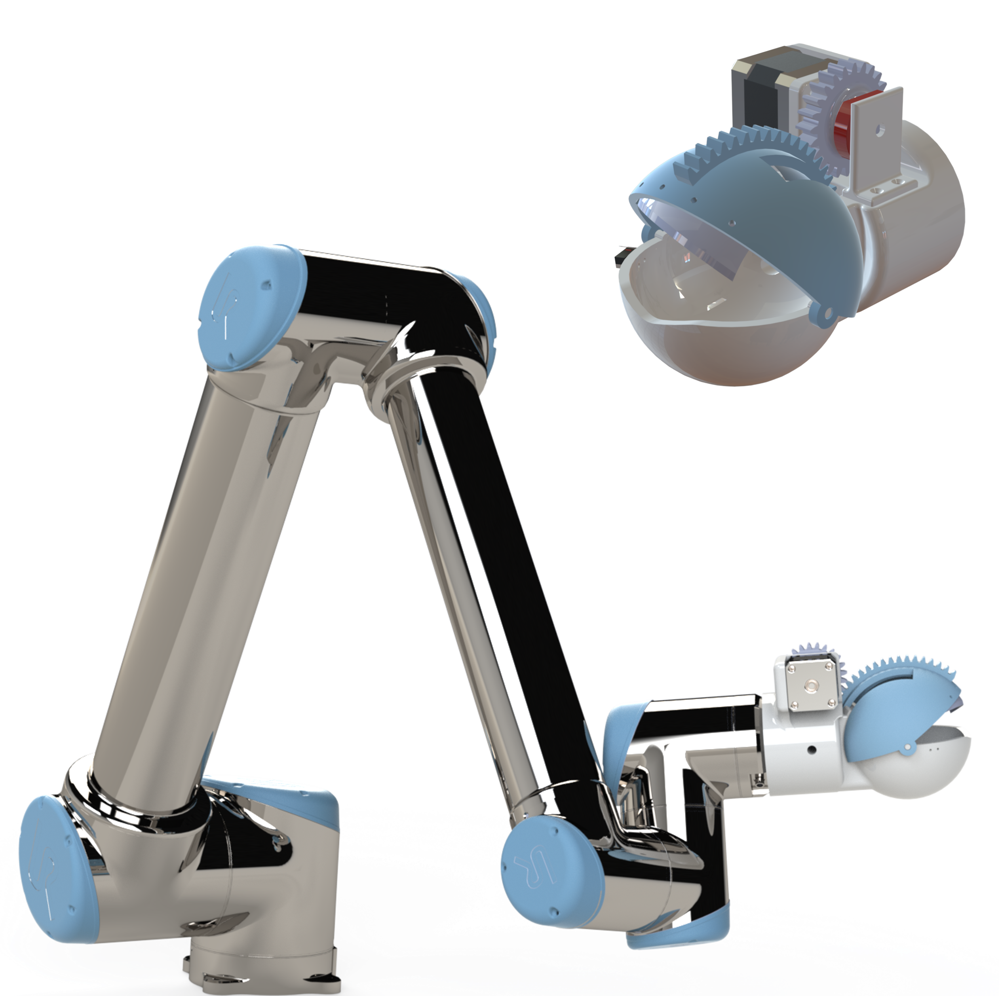
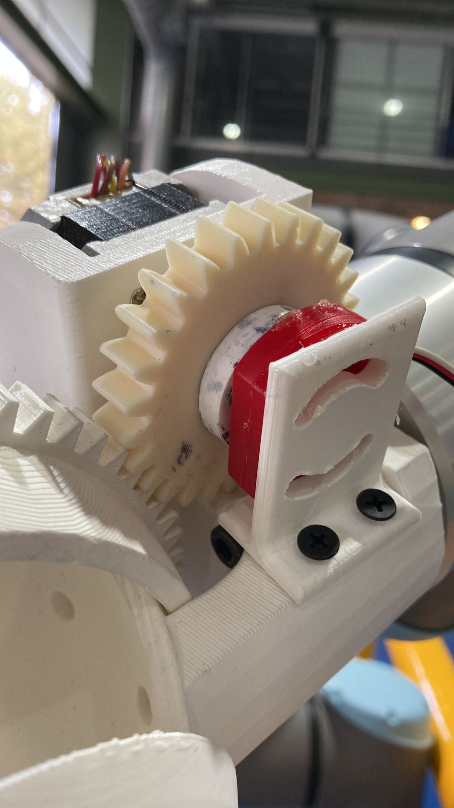
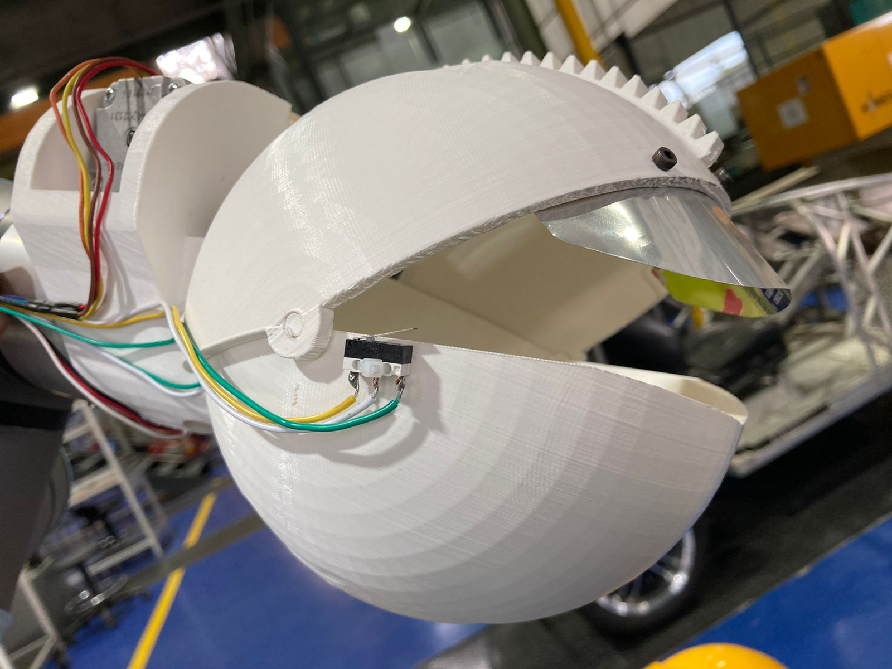
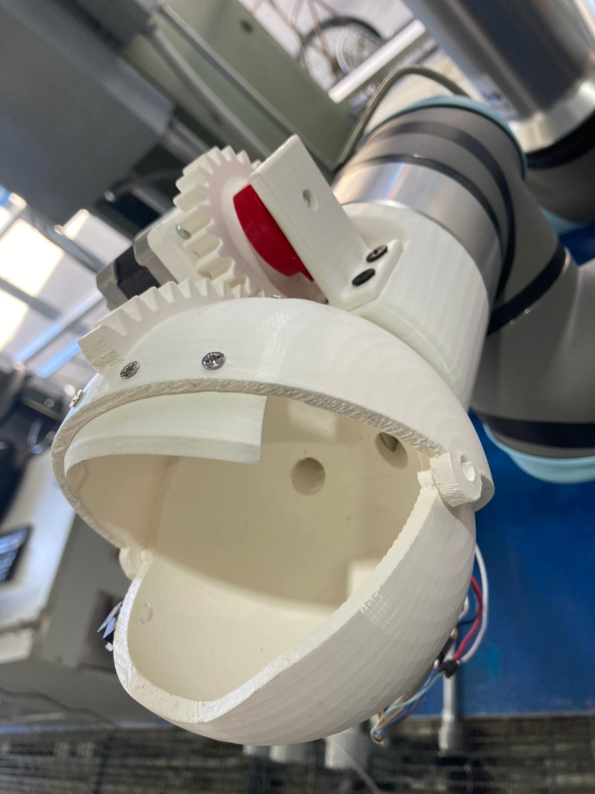
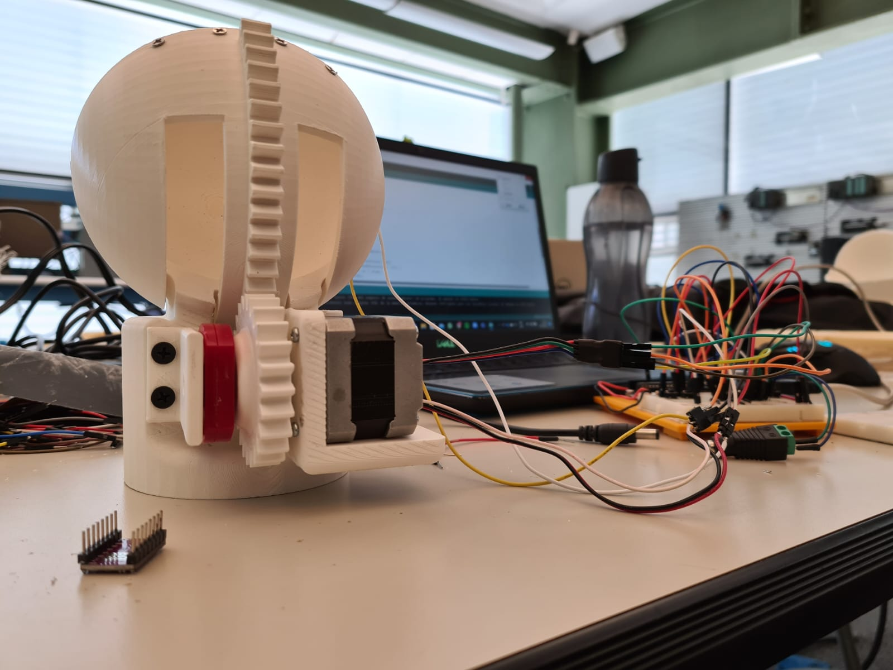

## Overview

This project was part of an international university challenge focused on autonomous tomato harvesting, conducted in collaboration with Mondragon Unibertsitatea and Tecnológico de Monterrey. The main contribution involved designing and building a functional gripper prototype for the robotic system.

The end-effector was developed using 3D-printed components and included an integrated stepper motor, limit switch, and potentiometer. The control system was implemented on an Arduino UNO, which managed the opening and closing of the gripper based on sensor inputs.

## System Integration

The gripper was mounted on a UR10 collaborative robot programmed to follow a predefined trajectory. The system was validated by successfully picking a tomato and placing it in a container.

## Main Features

- 3D-printed mechanical gripper
- Stepper motor for actuation
- Potentiometer for position feedback
- Limit switch for motion limits
- Arduino-based embedded control
- UR10e robotic arm integration

## Technologies Used

- SolidWorks for 3D design  
- Arduino UNO for stepper motor control  
- UR10e for robot motion execution  
- Manual wiring and prototyping tools  

## Gallery

  
  
  
  
  
  
  

