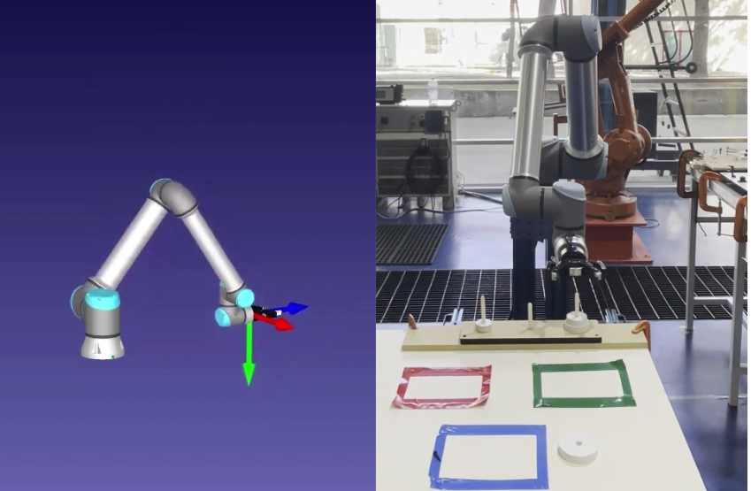

## Industrial Robotics – Tower of Hanoi Solver

Developed a Python-based inverse kinematics solution for a UR10e industrial robot to solve the classic Tower of Hanoi problem.

**Project Overview**  
• Implemented custom inverse kinematics in Python for precise pose calculation.  
• Designed and executed a sequence of 7 movements to solve a 3-disc Tower of Hanoi.  
• Controlled the UR10e through an interface between Python and the robot controller.  
• Achieved high precision: relative error under 0.1% in all poses.  

**Tools and Technologies**  
• Python  
• UR10 Robot (Universal Robots)  

## Gallery



<!-- 

  

 -->
