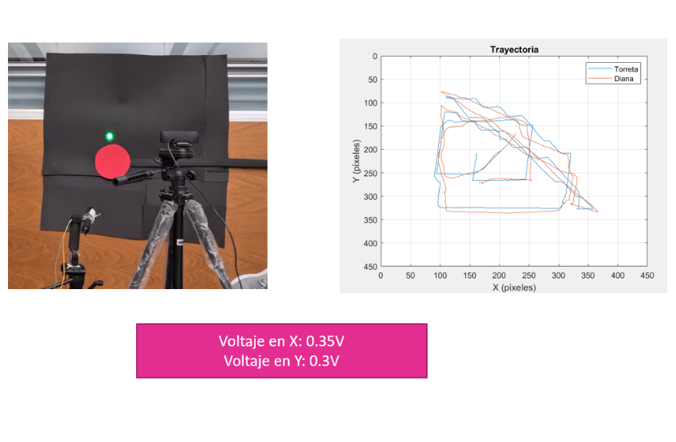

## Overview

This project involved designing and implementing a two-axis laser turret capable of tracking a moving red circular target in real-time. The system integrates a webcam, MATLAB for image processing, and an Arduino for PID-based actuation. The goal was to keep a laser pointer aimed at the target within a 1 m × 1 m workspace for at least 20 continuous seconds.

## System Description

The vision subsystem detects the position of a red object using color segmentation in MATLAB. This position is sent to the Arduino through serial communication. The Arduino processes the coordinates and drives two DC motors via a manually tuned PID controller to align the turret accordingly.

## Main Features

- Real-time red target detection via webcam  
- Manual PID control for dual-axis DC motor actuation  
- Two degrees of freedom for turret motion  
- Continuous laser alignment to follow the target  
- Data visualization and signal plotting in MATLAB  
- Mechanical model and structure designed in SolidWorks  

## Technologies Used

- MATLAB with Image Processing Toolbox  
- Arduino UNO  
- Serial Communication Protocol  
- SolidWorks for mechanical design  
- Custom PID control implementation in C++  

## Results

- Maintained laser alignment with a moving target  
- Stability confirmed under variable motion conditions  
- Visualization of position data and control signals  

## Gallery

  
  
  <!--  -->
  
  
  .
  

## Video


