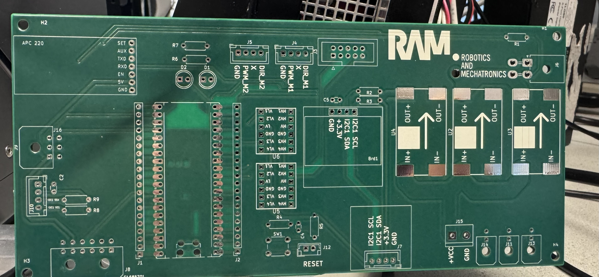
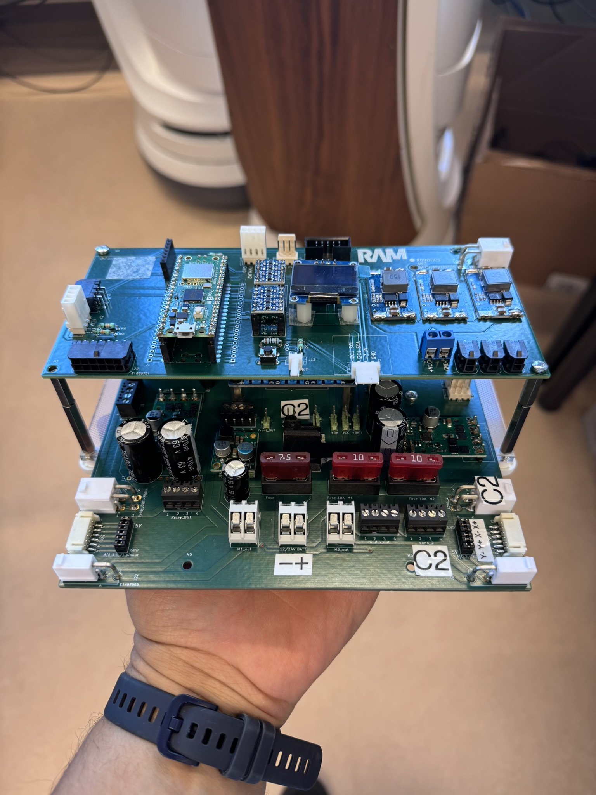
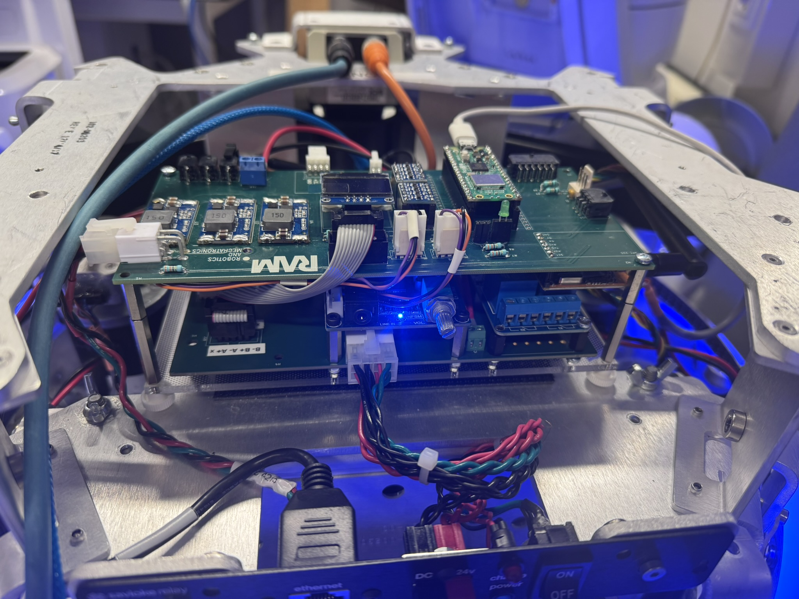
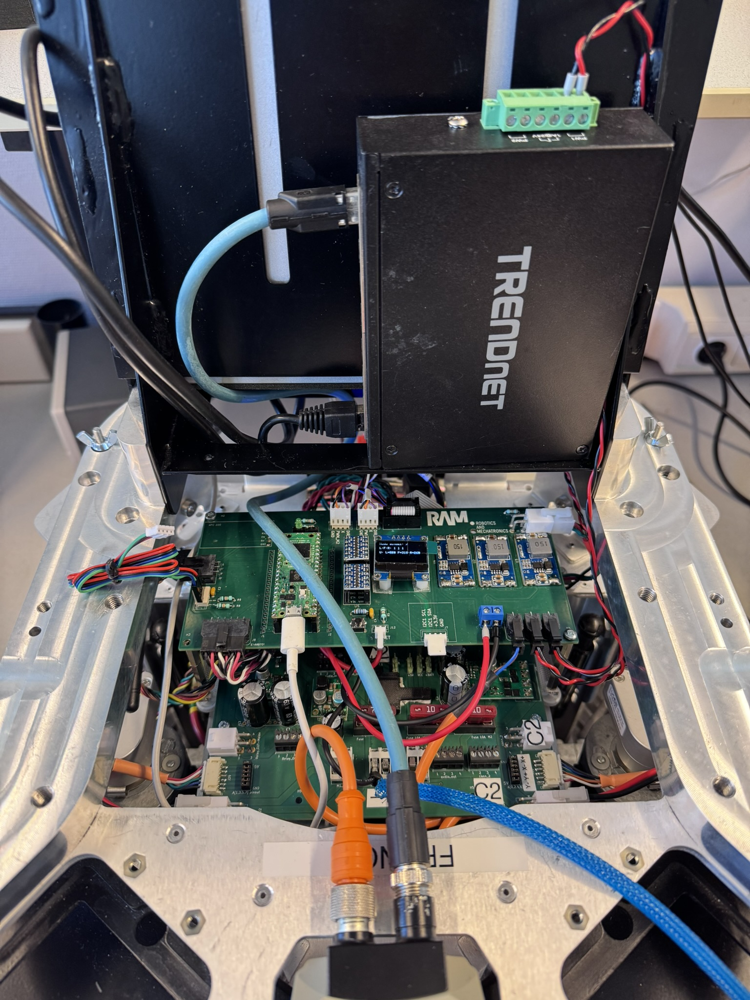
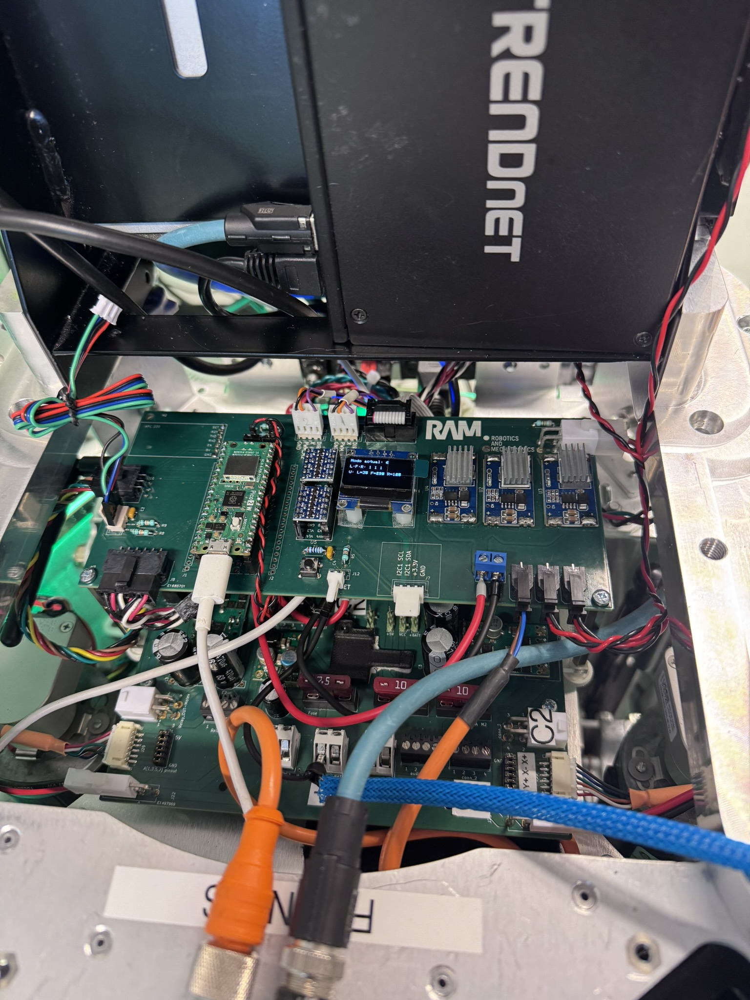

## Overview

This project corresponds to the development of the low-level control system for the KUKA iDo robot. The system is based on a custom PCB and embedded firmware running on a Raspberry Pi Pico W. It is responsible for real-time motor control, sensor acquisition, and communication with the high-level ROS 2 system via micro-ROS.

The firmware was developed in C++ using the official Pico SDK. All logic is executed within a centralized class that integrates control loops, sensor processing, and communication tasks.

## Functionalities

- Velocity control using dual PID loops and encoder feedback  
- Odometry estimation based on differential kinematics  
- micro-ROS integration for ROS 2 topic subscription and publication  
- Real-time acquisition of bumper states, battery levels, and IMU data  
- LED status indication controlled via ROS messages  
- Time synchronization for proper timestamping in ROS 2 environments  

## Architecture

- **Microcontroller:** RP2040 (Raspberry Pi Pico W)  
- **Firmware:** Custom C++ application with Pico SDK and micro-ROS  
- **PCB:** Custom-designed board with motor drivers, sensor connectors, and power regulation  

## Technologies Used

- C++ (bare-metal with Pico SDK)  
- micro-ROS
- Differential drive odometry  
- Custom PCB design (KiCad)  
- UART, I2C, and PIO peripherals  
- ROS 2 Jazzy for system integration  

## Gallery

  
  
  
  
  

