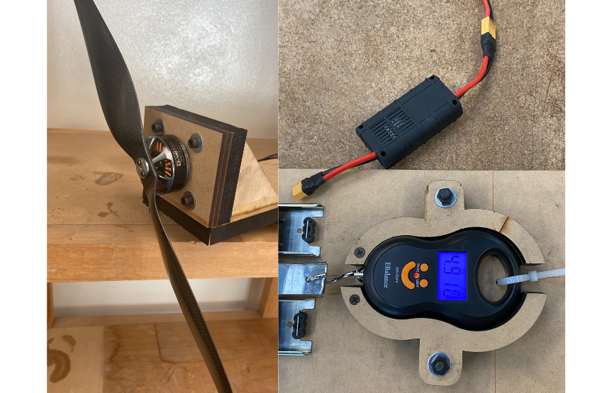

## Overview

This setup was built to evaluate thrust generated by electric propulsion systems for aerodesign applications. A brushless motor with a propeller is mounted on a fixed wooden frame, and the thrust is measured using a hanging digital scale.

The electrical system includes a LiPo battery, ESC, and XT60 connectors. The motor pulls against the hanging scale while spinning at different throttle levels, allowing thrust to be recorded under static conditions.

## Main Features

- Static thrust measurement using hanging digital scale  
- Brushless motor and propeller mounted on a fixed support  
- ESC and LiPo battery integration with safety connectors  

## Gallery

  

