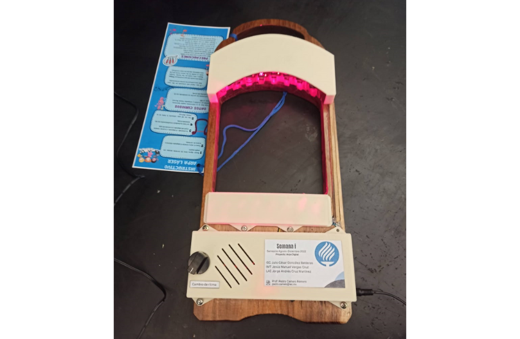

## Overview

This project is a laser harp, an electronic musical instrument that plays notes when the user interrupts RED laser light beams with their hand. Each beam represents one note. When a beam is blocked, a sensor detects the change and sends a signal to the Arduino to play the sound.

The system uses a curved structure with infrared emitters and photodiodes. An Arduino reads the sensors and generates sound using a small speaker. A knob lets the user change between rhythm or sound modes.

## How It Works

Each emitter is paired with a photodiode. When the light reaches the photodiode, the signal is stable. If a hand blocks the beam, the Arduino detects the change and plays a specific tone.

## Main Features

- Note triggering by blocking infrared beams  
- Sound generation using Arduino  
- Built-in speaker  
- Mode selector knob  

## Gallery

  

