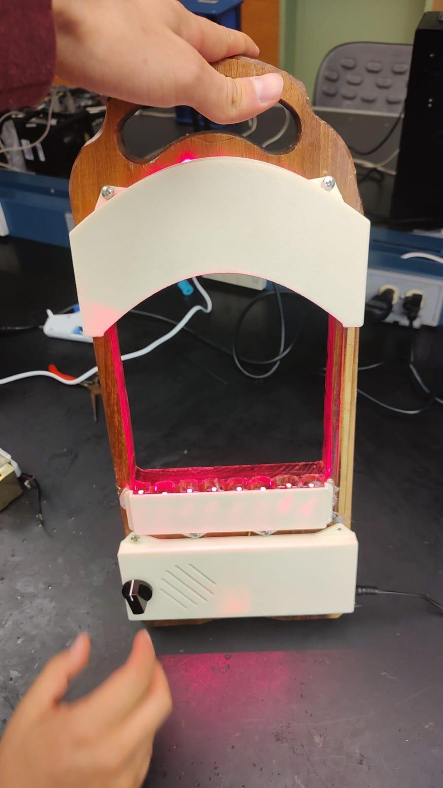

## Overview

This project consists of a laser harp, an interactive musical instrument that generates sound when a user interrupts visible laser beams with their hand. Each laser beam corresponds to a musical note. When the beam is blocked, the system detects the change and activates a tone through a built-in speaker.

The device is built on a curved wooden and plastic frame with multiple red laser diodes aligned with photodetectors (photodiodes). An Arduino microcontroller continuously reads each sensor and triggers a specific tone based on which beam was interrupted. A rotary selector allows the user to switch between rhythm or tone modes.

## How It Works

Each laser diode is aligned with a corresponding photodiode. When the beam reaches the sensor, the voltage level remains stable. When a hand blocks the beam, the Arduino detects the voltage drop and activates the sound associated with that position. The tones are generated programmatically within the Arduino.

## Main Features

- Sound triggering via visible laser beam interruption  
- Use of red laser diodes and aligned photodiodes  
- Arduino-controlled tone generation  
- Mode selection using rotary knob  
- Integrated speaker for audio output  

## Gallery

  
  

