## Overview

Robociety was a student robotics group dedicated to the design and development of small robots for competitions. The team focused on mini-sumo, micro-sumo, and maze-solving categories.
As cofounder, I contributed to the group’s on embedded control, mechanical design, and printed circuit boards.

## My Role

- Cofounde
- Development of PCB layouts
- Mechanical design of compact robot frames and gear systems  
- Firmware development 

## Technologies Used

- SolidWorks for CAD and assembly  
- KiCAD for PCB design  
- Arduino (C/C++) for embedded control logic  
- Infrared and ultrasonic sensors for detection  
- Brushed DC motors with gear reductions  

## Gallery

  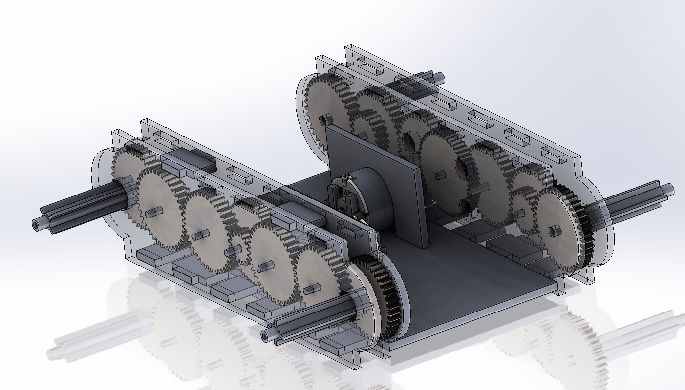
  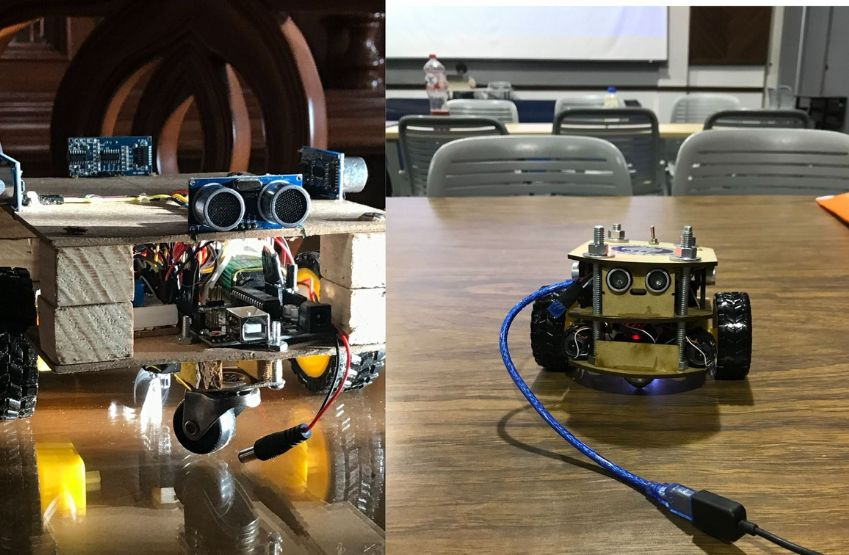
  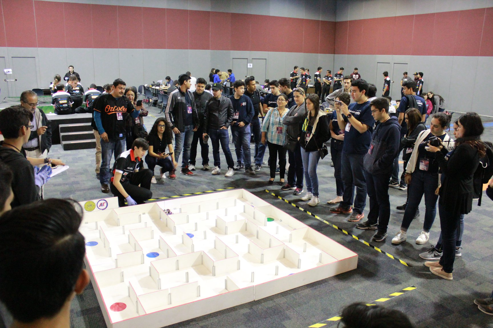
  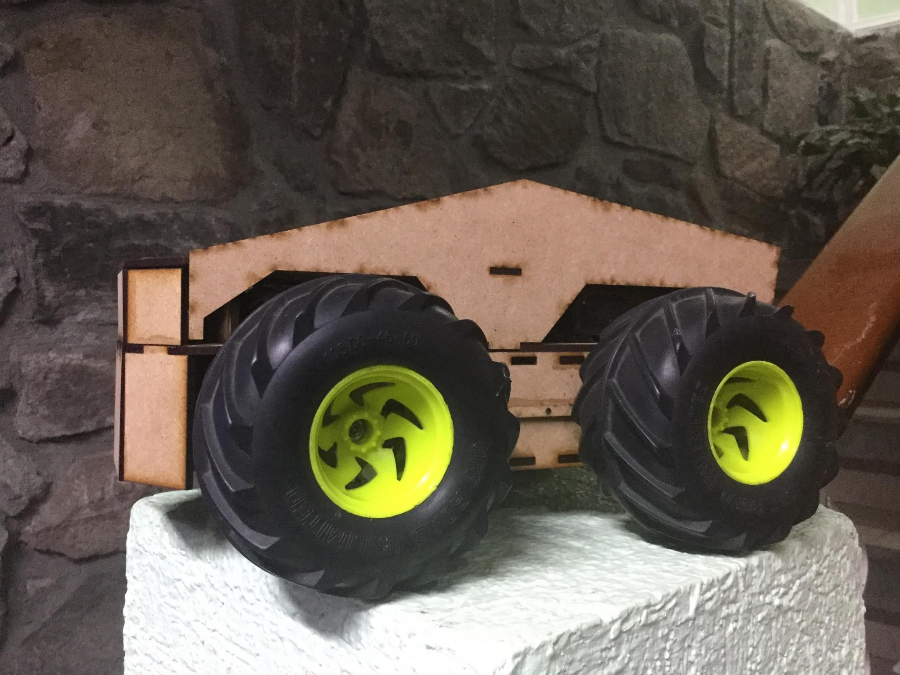
  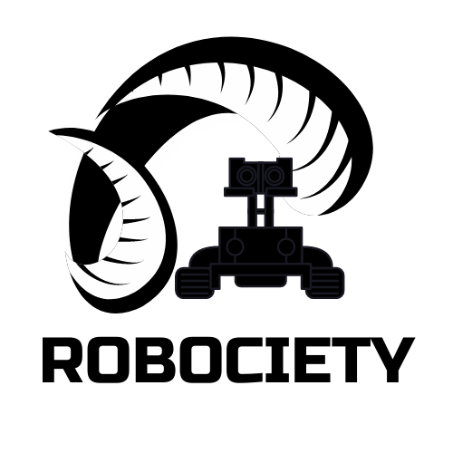
  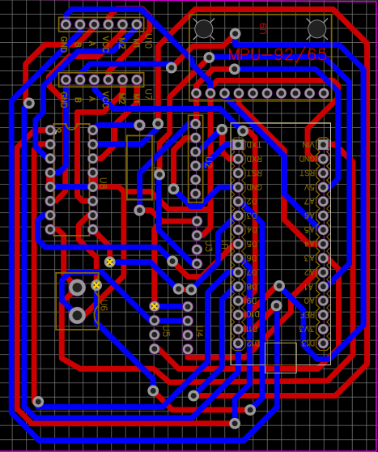
  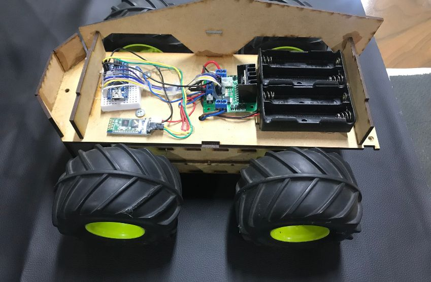
  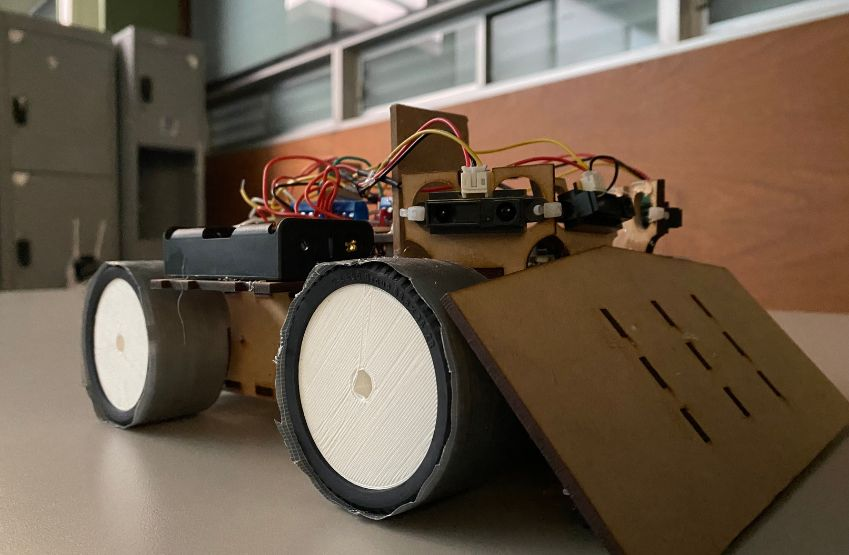
  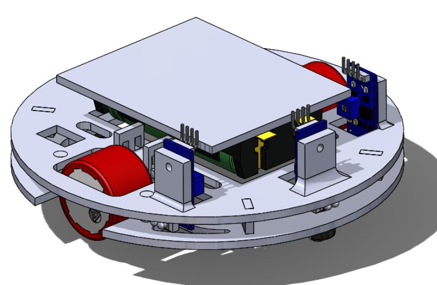
  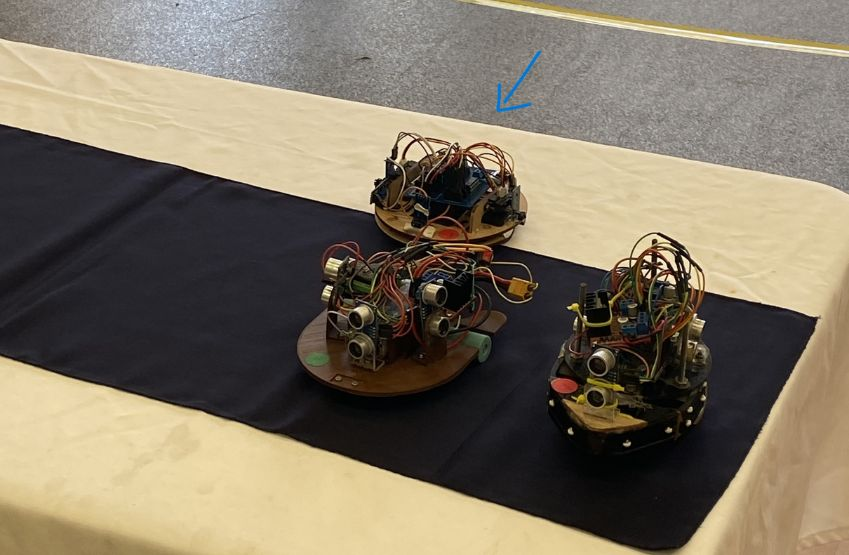
  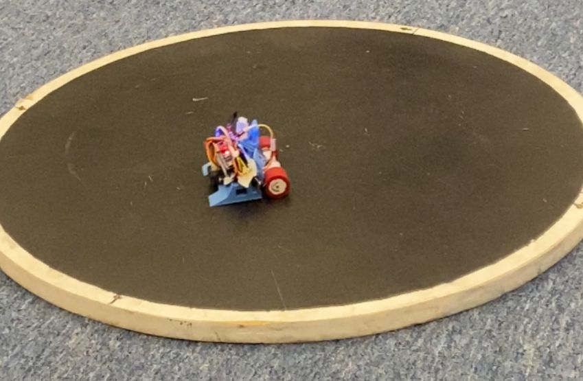
  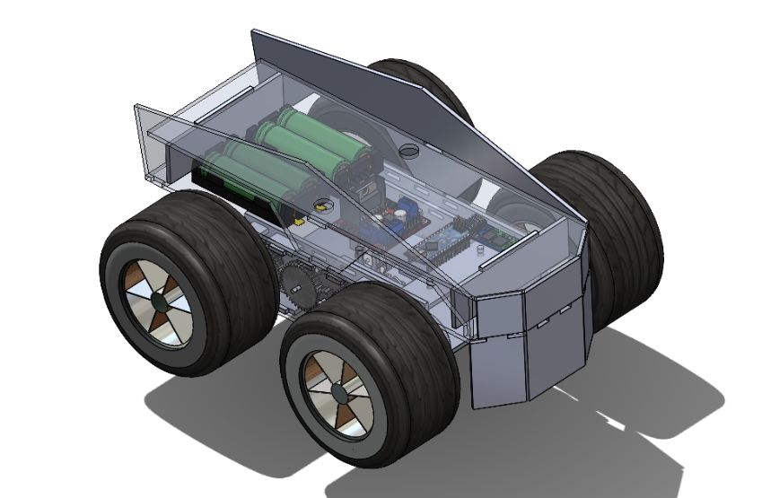
  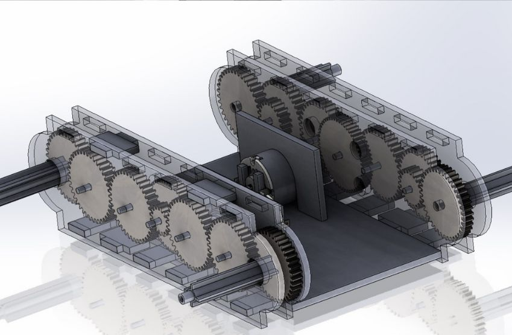

