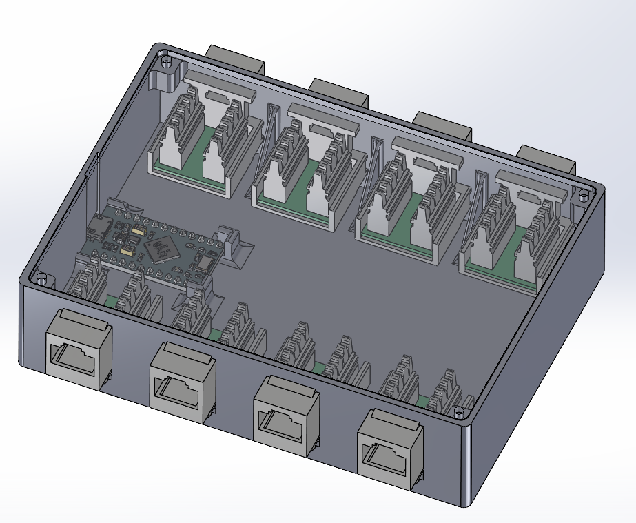
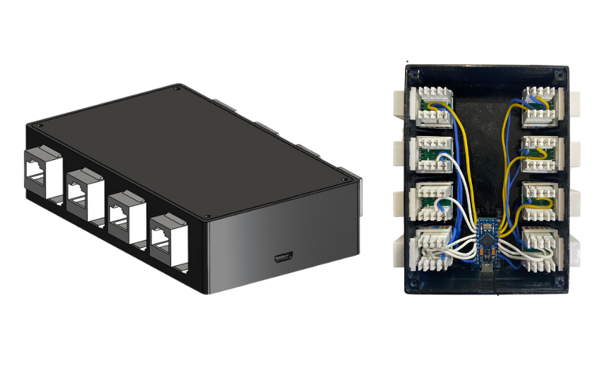
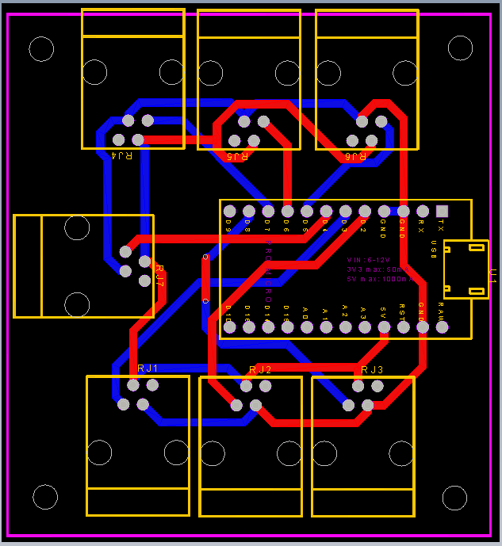

## Overview

This project consists of the design and implementation of a modular sensor interface for a driving simulator. The goal is to replicate the control inputs from sensors or devices found in a real vehicle—such as the gear lever, turn signals, ignition switch, and others—and convert them into signals that can be read by a computer using a USB connection.
The module works as a standard USB Human Interface Device (HID), similar to a joystick or game controller, allowing it to be recognized easily.
The system uses an Arduino Pro Micro, which includes native USB support and is well-suited for HID communication. Each sensor is connected through RJ-type connectors to keep the design clean, modular, and easy to maintain or modify.

## Connected Sensors

The interface supports the following input devices:

- Gear lever (position detection)
- Turn signals (left/right indicators)
- Ignition switch (start button)
- Seatbelt sensor
- Parking brake sensor
- Directional indicator control

## Technologies Used

- **Microcontroller**: Arduino Pro Micro (ATmega32U4)
- **Design tools**: KiCad for PCB design, SolidWorks for mechanical modeling
- **Connection interface**: RJ connectors for modular sensor integration
- **USB communication**: HID protocol for native joystick compatibility

## Gallery

  
  
  
  

