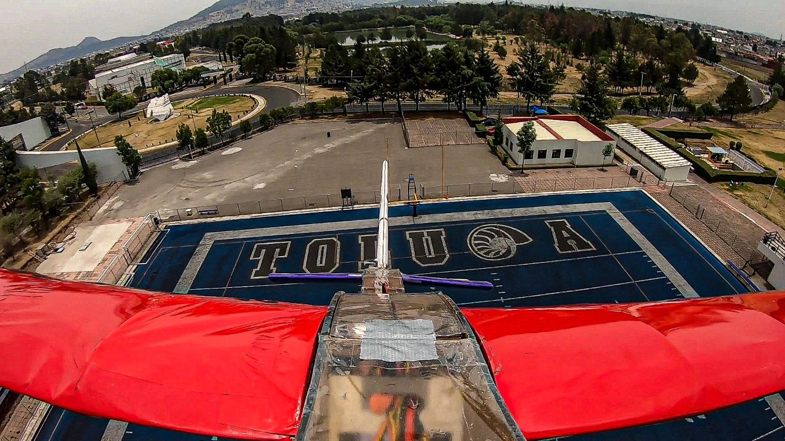
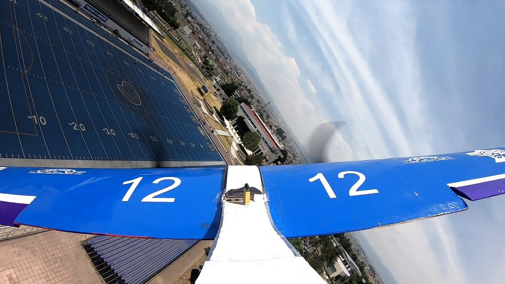
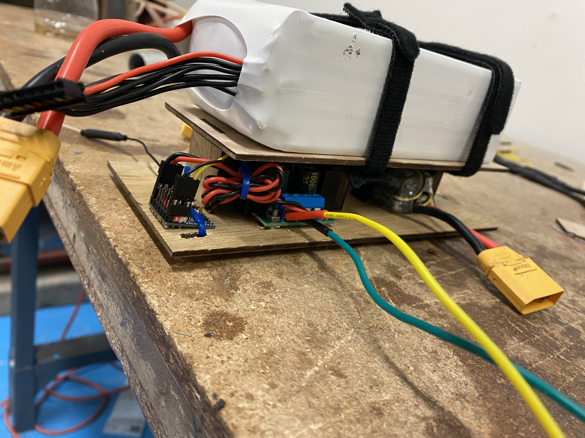

## Overview

**TEUS 2023** was the aircraft designed and developed for participation in the **SAE Aerodesign México** national competition. The objective of the contest was to construct a remote-controlled aircraft capable of lifting a maximum payload under cargo dimensional and power consumption constraints.

## Contributions

- Designed the wing profile and internal structural frame using **SolidWorks**.
- Constructed and assembled the fuselage and propulsion elements.
- Performed motor–propeller characterization using a custom-built test bench.
- Participated in telemetry setup, weight distribution analysis, and test flights.
- Competed in the official SAE Aerodesign México 2023.

## Technologies Used
- SolidWorks for mechanical design  

## Gallery

  
  
  

