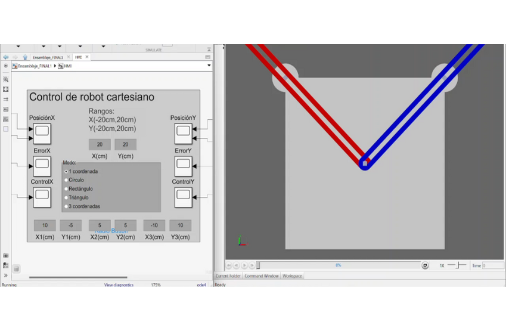
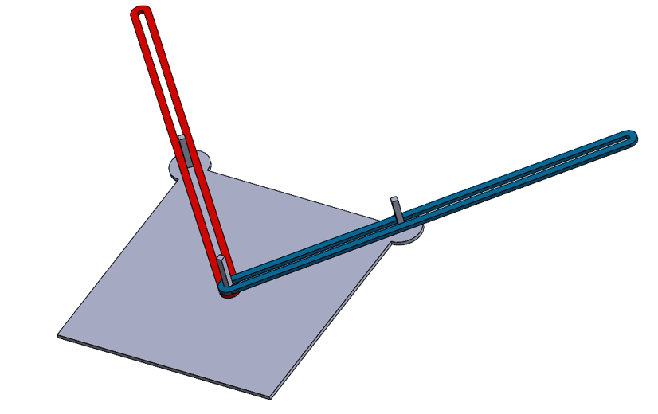

## Overview

This project consisted of modeling and simulating a vertical CNC router using MATLAB. The system was designed to demonstrate position control over two perpendicular linear axes (X and Y), mimicking the behavior of a basic CNC machine.

The model includes actuator dynamics, position feedback, and trajectory generation, with the control logic implemented in discrete time using PID controllers.

## Key Features

- 2-axis CNC system simulation  
- Upright router configuration modeled in 3D CAD  
- Discrete PID control implemented in MATLAB  
- Visualization of tool motion and path tracking  
- Position reference generation for square and circular trajectories  

## Technologies Used

- MATLAB and Simulink  
- Control System Toolbox  
- SolidWorks for mechanical modeling  

## Gallery

  
  


