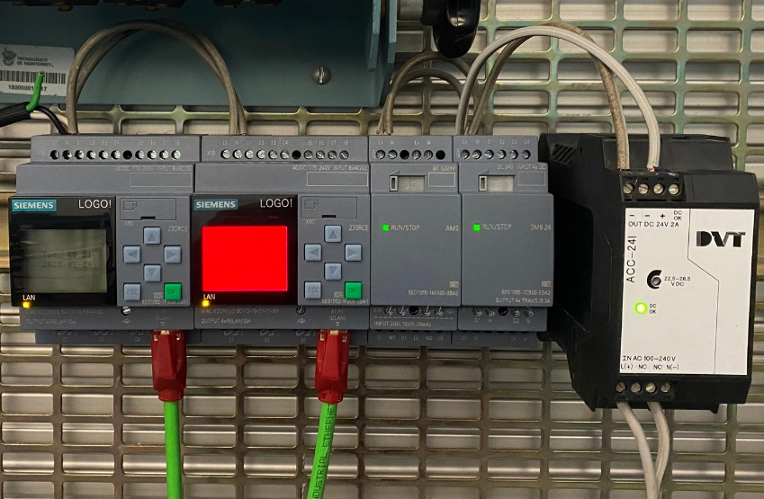
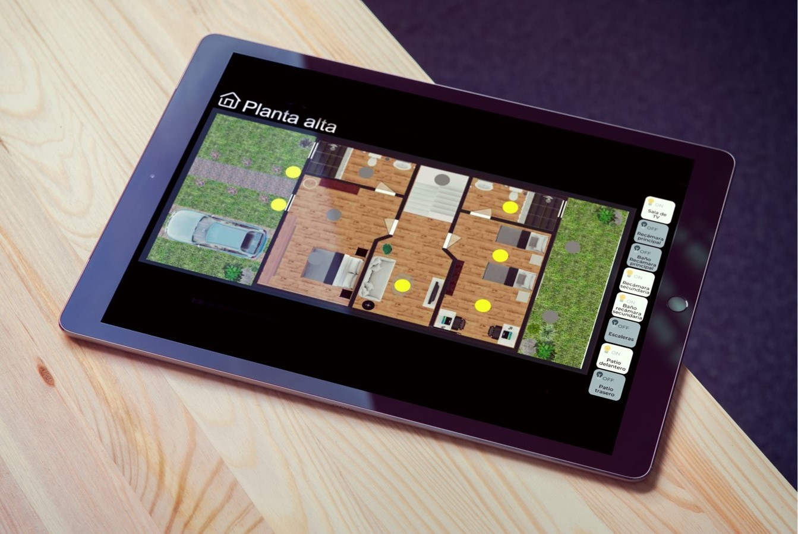
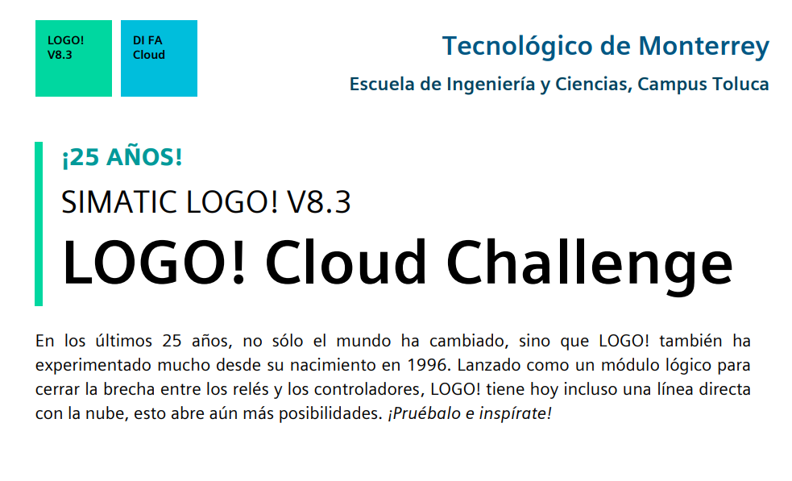
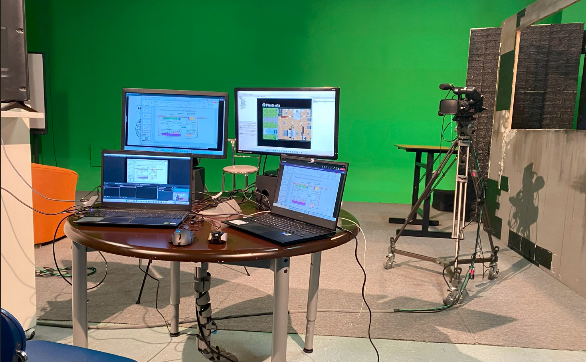

## Overview

This project consists of a programmable control system designed to monitor household water consumption using a Siemens LOGO! PLC. The system receives flow measurements from a water flow sensor and tracks total consumption over time, displaying data through a user interface panel.

The objective was to automate water usage tracking in domestic installations and evaluate how programmable logic controllers can be used for energy efficiency and sustainability applications.

## Key Features

- Real-time flow measurement using a digital flow sensor  
- Accumulated water consumption display on HMI screen  
- Alarm activation if consumption exceeds threshold  
- Integration of LOGO! Soft Comfort for ladder logic programming  
- 230V-compatible input/output wiring for solenoid valve control  

## Technologies Used

- Siemens LOGO! 12/24RCE  
- LOGO! Soft Comfort (v8)  
- Hall-effect water flow sensor  
- Relay actuators and solenoid valves  
- Ladder Logic Programming  
- Low-voltage AC wiring and safety relays  

## Gallery

  
  
  
  
  
  

