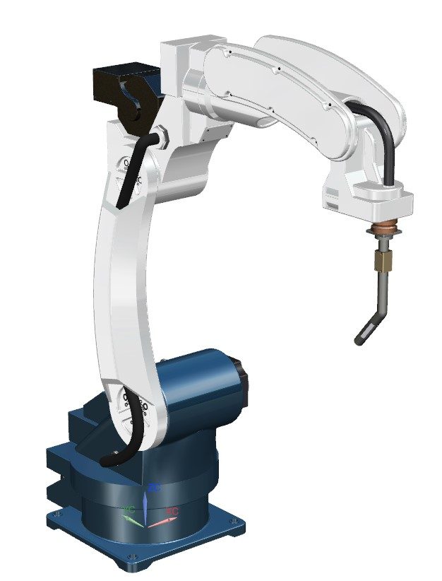
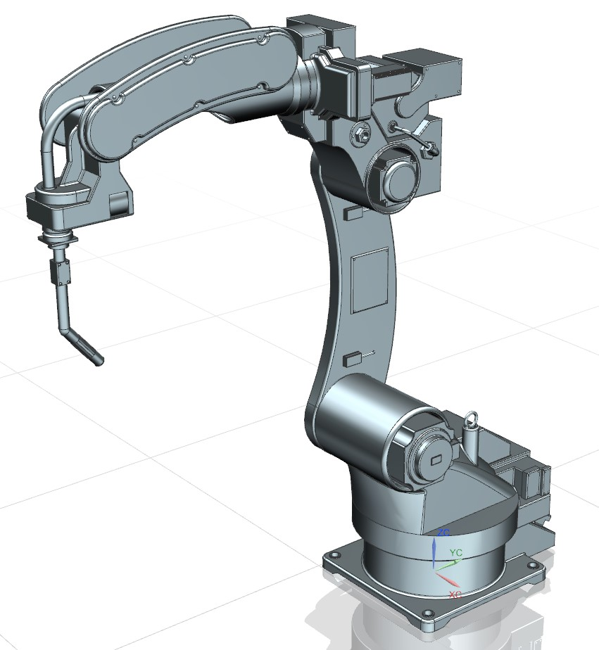
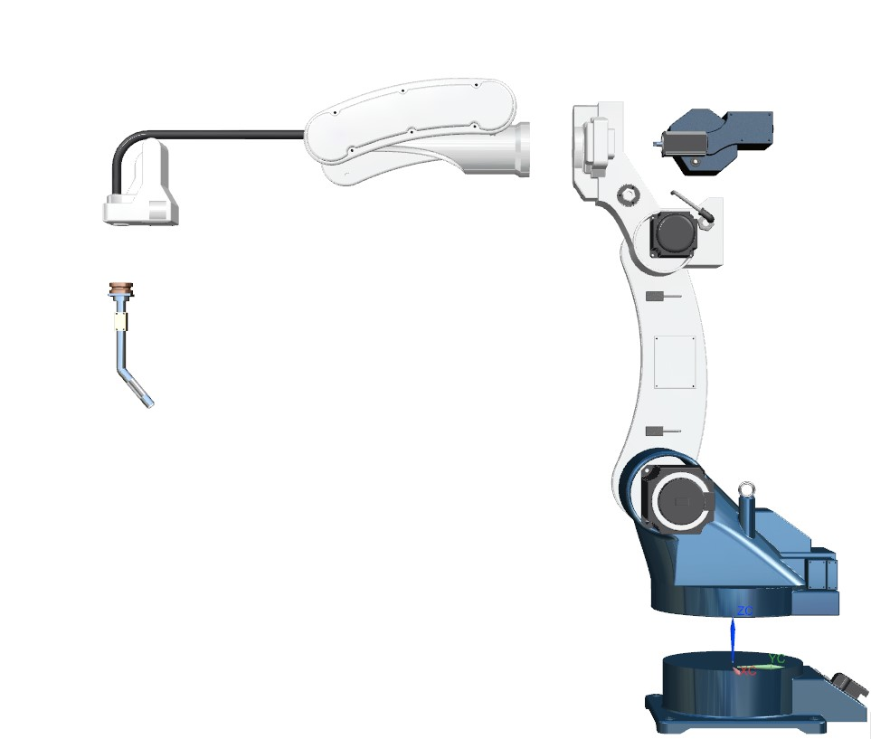

## Overview

This project involved the 3D CAD design of a robotic arm intended for automated welding tasks in industrial environments. The model includes articulated joints, an end-effector mount for welding tools, and structural supports, all designed to evaluate kinematic reach and workspace coverage.

The objective was to design a functional and manufacturable mechanical model suitable for simulation and potential prototyping.

## Key Features

- 5-axis articulated robotic arm design  
- End-effector mount for welding tool integration  
- Workspace optimization and joint reach evaluation  
- Modular joint design for easy assembly and simulation  
- Full CAD modeling in SolidWorks including exploded views  

## Technologies Used

- SolidWorks (3D CAD modeling and motion study)  
- Kinematic analysis tools for reach and joint range  
- Design-for-manufacturing (DFM) considerations  
- Engineering drawings and assembly documentation  

## Gallery

  
  
  
  

