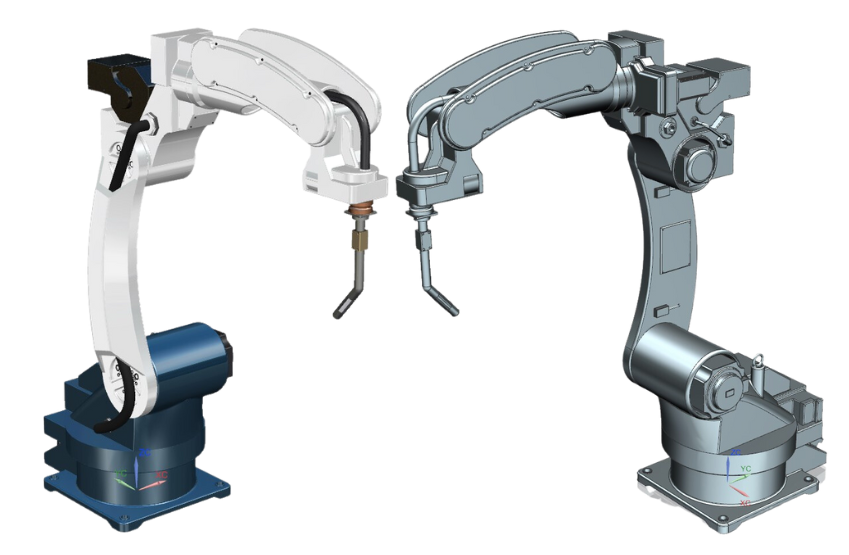
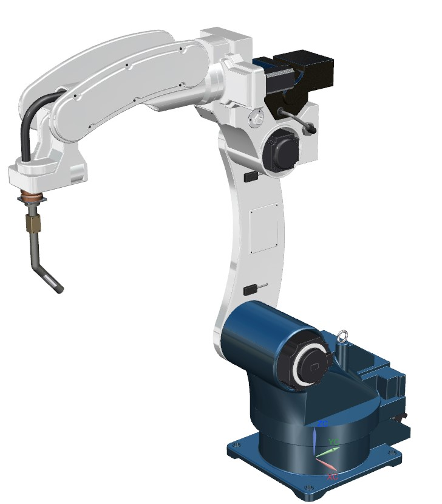

## Overview

This project was developed as part of a Computer-Aided Design (CAD) course and involved the conceptual design of a robotic arm for welding applications. Using Siemens NX, the model explores joint articulation, link dimensions, and basic structural layout. The purpose was to apply CAD principles and practice 3D modeling of mechanical assemblies, without aiming for a fully functional or industrial-grade design.

## Key Features

- Conceptual robotic arm with articulated joints  
- Simplified end-effector interface for welding simulation  
- Modular design for assembly illustration  
- Exploded and assembled views modeled in NX  

## Technologies Used

- Siemens NX (Part modeling, assemblies, exploded views)  
- Basic engineering drawing generation for components  

## Gallery

  
  

